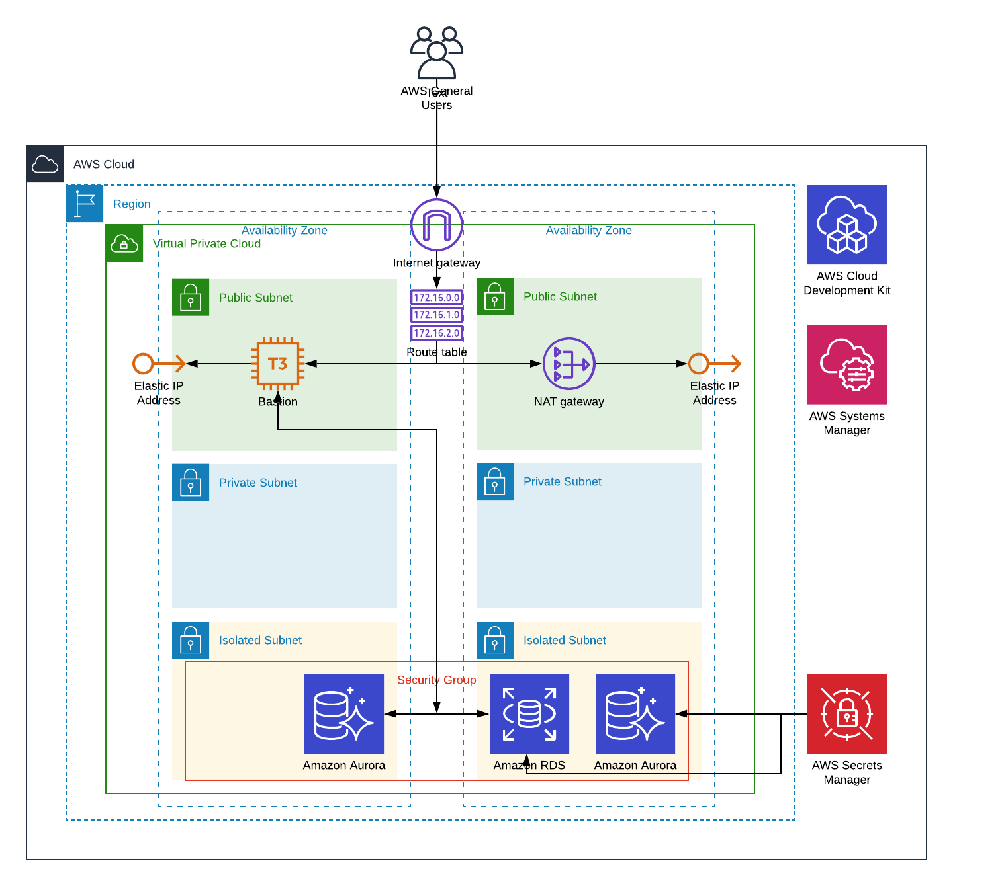

# Python CDK with VPC + Postgres DB
AWS Cloud Development Kit (AWS CDK) is a software development framework for 
defining cloud infrastructure in code and provisioning it through AWS 
CloudFormation. Here's a python example for building a VPC, Bastion host and a 
Postgres database using RDS (provisioned or serverless). Here's a general view of the 
architecture.



## Installation

### Python virtual environment
```
virtualenv aws_cdk.env
cd aws_cdk.env
source bin/activate
```

### Install AWS CDK 
```
npm install -g aws-cdk
cdk --version
cdk --help
```
No harm to read up the docs: https://docs.aws.amazon.com/cdk

### Install the dependencies:
```
pip install aws-cdk.aws-s3
pip install aws-cdk.aws-ec2
pip install aws-cdk.aws-rds
pip install aws-cdk.aws-events-targets
pip install -r requirements.txt
```

When new versions come available, no harm in keeping up to date:
```
pip install --upgrade aws-cdk.core
pip install --upgrade aws-cdk.aws-s3
pip install --upgrade aws-cdk.aws-ec2
pip install --upgrade aws-cdk.aws-rds
pip install --upgrade aws-cdk.aws-events-targets
```

### Set up your AWS profile file ~/.aws/config
```
[profile cdk_profile]
aws_access_key_id=AKIAI44QH8DHBEXAMPLE
aws_secret_access_key=je7MtGbClwBF/2Zp9Utk/h3yCo8nvbEXAMPLEKEY
region=eu-west-1
```

## Synthesizing the stacks. 

The --no-version-reporting option removes the `AWS::CDK::Metadata` resources and opts out of 
module version reporting to AWS.
. 
```
cdk --profile cdk_profile --no-version-reporting synth VPC AuroraServerless PostgresRDS
```

### Debugging a stack
```
cdk --profile cdk_profile --no-version-reporting synth VPC  > vpc.yaml
aws cloudformation validate-template --template-body file://vpc.yaml 
```

## Deploying the stacks
```
cdk --profile cdk_profile --no-version-reporting deploy VPC AuroraServerless PostgresRDS
```

## Destroying the stacks
```
cdk --profile cdk_profile --no-version-reporting destroy VPC AuroraServerless PostgresRDS
```

### To access the aurora serverless postgres database you've got a few options:

#### 1. Log into the cluster using the AWS console with secrets manager use AuroraServerless.DatabaseSecretArn above
```
https://<region>.console.aws.amazon.com/rds/home?region=<region>#query-editor:/instance/aurora-serverless-postgres-db
```
You can execute SQL directly in the console.

#### 2. Log into cluster from the Bastion (requires database password from secrets manager)
```
# Get Bastion id
aws ec2 describe-instances \
  --profile cdk_profile \
  --filter "Name=tag:Name,Values=BastionHost" \
  --query "Reservations[].Instances[?State.Name == 'running'].InstanceId[]" \
  --output text

aws ssm --profile cdk_profile start-session --target "<id from previous step>"

# Passing user data to CfnDBCluster wasn't possible so needed to install postgresql
sudo yum -y update
sudo yum install -y postgresql.x86_64

psql \
  --host=<AuroraServerless.AuroraEndpointAddress> \
  --port=5432 \
  --username=admin_user \
  --dbname=slsdb
```

#### 3. Log into cluster with psql locally

a. Configure ssh locally to proxy commands through ssm
```
# Add the following to the .ssh/config file
host i-* mi-*
    ProxyCommand sh -c "aws ssm start-session --target %h --document-name AWS-StartSSHSession --parameters 'portNumber=%p'"
```

b. Get Bastion id (see above)

c. Log into Bastion and place your id_rsa.pub key in .ssh/authorized_keys file of the ssm-user. 
```
aws ssm --profile cdk_profile start-session --target "<instance id from step b>"
cd /home/ssm-user
mkdir .ssh ; vi .ssh/authorized_keys # paste key 
cd /home/ssm-user
chmod 700 .ssh; chmod 640 .ssh/authorized_keys
```

d. Locally create the ssh tunnel
```
ssh -N \
    -L "localhost:5432:<AuroraServerless.AuroraEndpointAddress>:5432" \
    ssm-user@<instance id from step b>
```

e. Using a new shell, log into Aurora with psql. This same setup can be used in your favourite IDE such as 
pgAdmin/DataGrip/PyCharm/etc. 

```
psql \
  --host=localhost \
  --port=5432 \
  --username=admin_user \
  --dbname=slsdb
```

(References) Some useful blogs and docs:
http://wrschneider.github.io/2019/09/10/ssm-ssh-tunnel.html

https://docs.aws.amazon.com/systems-manager/latest/userguide/session-manager-getting-started-enable-ssh-connections.html

https://aws.amazon.com/blogs/aws/new-port-forwarding-using-aws-system-manager-sessions-manager/

## CDK Examples
https://github.com/aws-samples/aws-cdk-examples/tree/master/python

https://github.com/aws-samples/aws-cdk-examples/tree/master/python/new-vpc-alb-asg-mysql

https://github.com/aws-samples/aws-aurora-serverless-data-api-sam/blob/master/deploy_scripts/rds_cfn_template.yaml

## CDK Python API
https://docs.aws.amazon.com/cdk/api/latest/python 

https://docs.aws.amazon.com/cdk/api/latest/python/aws_cdk.aws_ec2/Vpc.html

https://docs.aws.amazon.com/cdk/api/latest/docs/aws-events-readme.html

## Blogs
https://blog.codecentric.de/en/2019/09/aws-cdk-create-custom-vpc/

https://blog.codecentric.de/en/2019/10/aws-cdk-part-2-s3-bucket/

https://blog.codecentric.de/en/2019/09/aws-cdk-versus-terraform-and-serverless-framework/

https://stackoverflow.com/questions/55818680/how-to-set-dbparametergroup-family-property-for-postgres-10-6/55818740

https://sanderknape.com/2019/05/building-serverless-applications-aws-cdk/

https://labs.consol.de/development/2019/11/04/introduction-to-aws-cdk.html

https://jimmydqv.com/aws/cloudformation/infrastructure/cdk/2019/08/14/aws-cdk-first-impression.html

https://dev.to/hoangleitvn/top-reasons-why-we-use-aws-cdk-over-cloudformation-2b2f

https://aws.amazon.com/blogs/aws/new-data-api-for-amazon-aurora-serverless/

https://madabout.cloud/2019/09/01/aws-data-api-for-amazon-aurora-serverless/

https://read.acloud.guru/getting-started-with-the-amazon-aurora-serverless-data-api-6b84e466b109

## Docs 
https://docs.aws.amazon.com/AmazonRDS/latest/AuroraUserGuide/aurora-serverless.html

https://aws.amazon.com/blogs/database/using-the-data-api-to-interact-with-an-amazon-aurora-serverless-mysql-database/

## Tools
https://studio.infviz.io/

## CIDR Blocks
http://jodies.de/ipcalc?host=10.0.0.0&mask1=16&mask2=

https://cloudacademy.com/course/aws-virtual-private-cloud-subnets-and-routing/vpc-cidr-blocks/

## Aurora Serverless 
https://github.com/chanzuckerberg/sqlalchemy-aurora-data-api

https://www.npmjs.com/package/@cfn-modules/rds-aurora-serverless-postgres

https://stackoverflow.com/questions/51879688/creating-an-aurora-serverless-cluster-from-cloudformation

https://stackoverflow.com/questions/59409935/create-cfndbcluster-in-non-default-vpc?rq=1
